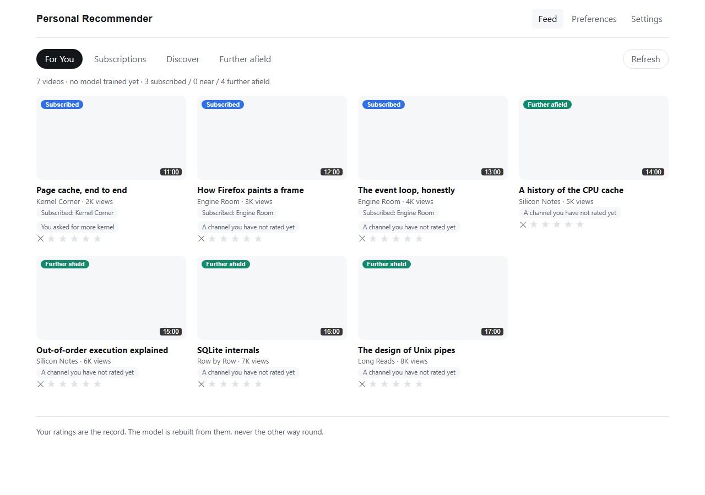
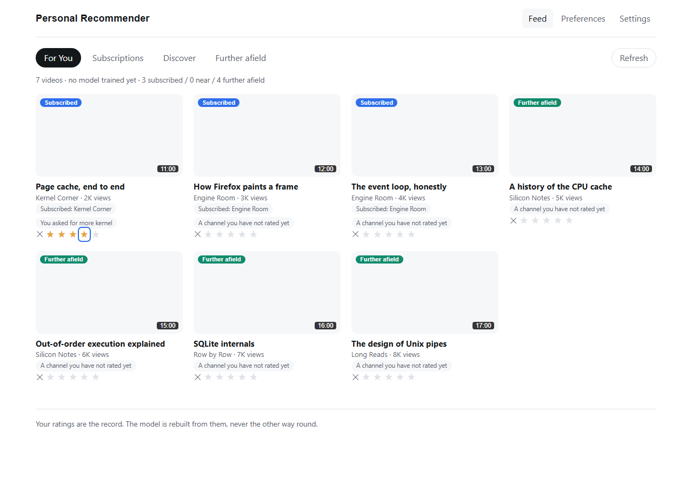
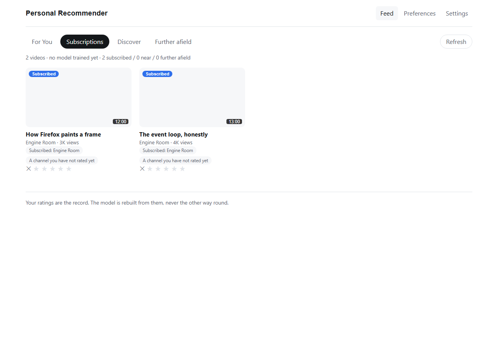
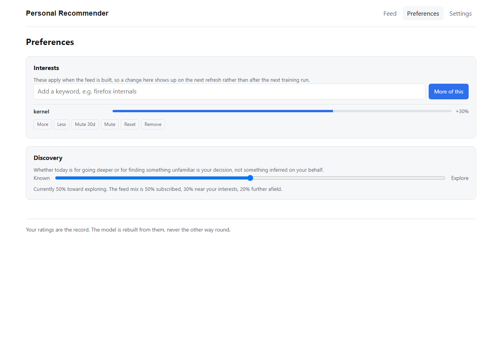
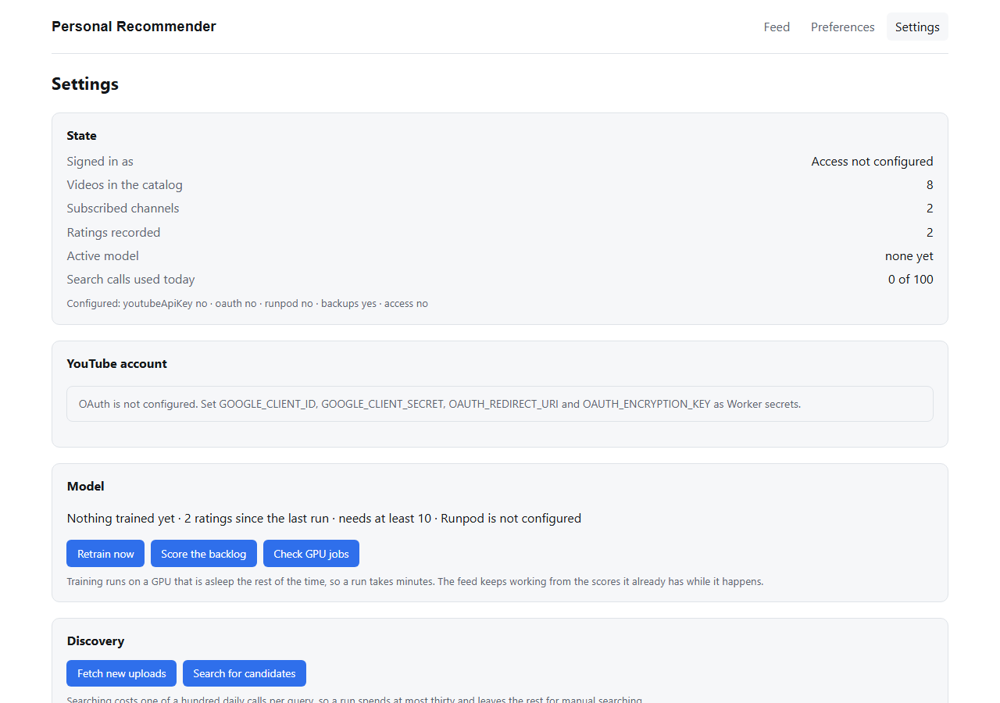
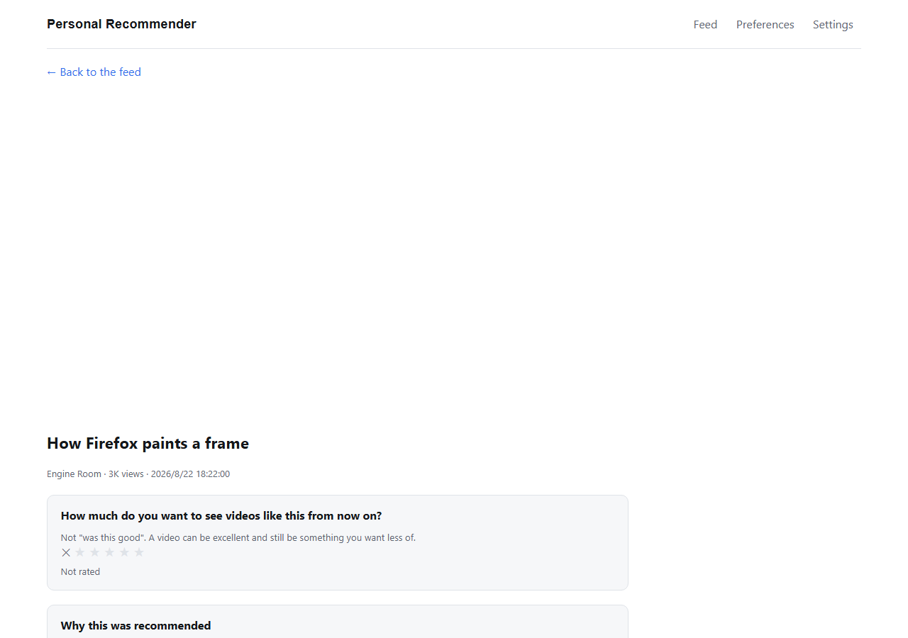

# Verification run

Recorded 2026/8/24 18:22:14 JST by `node tools/verify-screenshots.mjs`, against `wrangler dev --local`
with a seeded catalog and no external credentials.

## 1-feed

The feed, ranked without a trained model: every candidate scores at the pool mean, so ordering falls to the bonuses.

## 2-rated

Rated "Page cache, end to end" four out of five. The card updates in place rather than re-ranking under the cursor.

## 3-subscriptions

The subscription lane on its own. Filtering to a lane must not borrow from the others.

## 4-preferences

An interest control. It applies when the feed is built, so it takes effect on the next refresh rather than the next training run.

## 5-settings

What is configured and what is not. Runpod and Access are absent in a local run, and the screen says so rather than failing.

## 6-video

"How Firefox paints a frame" with the YouTube player, the rating question and the reasons the score was what it was.

